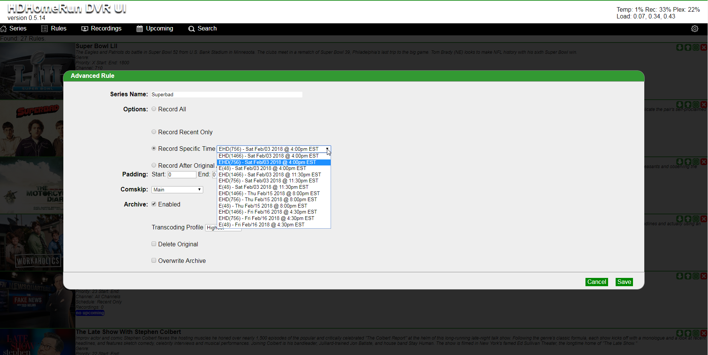

# *HDHR-DVRUI+*
PHP Server Application for managing your home networks HDHomeRun DVR(s) from SiliconDust including post-processing and enhanced scheduling

This fork was done to make changes specific to the fine app by [demonrik](https://github.com/demonrik) and [avandeputte](https://github.com/avandeputte) that fell outside of the scope of the original project.
My setup uses a powerful Ubuntu server (8 core Xeon 2 GB VM) to record, post-process, archive to a NAS and notify Plex of the new video.
The UI has been modified to allow for post processing of the video content including commercial removal, archiving, transcoding and cleanup of the incoming video content.

### After a base installation of Ubuntu Server I ran the following:

### install file monotoring [iWatch](http://iwatch.sourceforge.net/index.html) (not Apple)
    wget http://ftp.debian.org/debian/pool/main/i/iwatch/iwatch_0.2.2-5_all.deb
    sudo dpkg -i iwatch_0.2.2-5_all.deb
    sudo apt-get install -f

### install commercial removal: [comskip](http://www.kaashoek.com/comskip/)
    git clone git://github.com/erikkaashoek/Comskip
    cd Comskip
    ./autogen.sh
    ./configure
    make

### install transcoding: [FFmpeg](https://www.ffmpeg.org/)
    sudo add-apt-repository ppa:mc3man/trusty-media
    sudo apt-get install ffmpeg

### install file renaming for Plex to get episode title: [Python/PyQuery](https://pythonhosted.org/pyquery/)
    sudo apt-get install libxml2-dev libxslt1-dev python-dev
    sudo pip install pyquery

### install apache
    sudo apt-get install apache2

### install HDHR-DVRUI to the Apache directory
    git clone git://github.com/phillipssc/HDHR-DVRUI.git
    sudo cp HDHR-DVRUI/app/bin/postprocess.sh /usr/bin/
    sudo cp HDHR-DVRUI/app/bin/postprocessclean.sh /usr/bin/
    sudo cp HDHR-DVRUI/app/bin/postprocessvars.sh /usr/bin/
    sudo cp HDHR-DVRUI/app/bin/postprocesswatch.sh /usr/bin/
    sudo cp HDHR-DVRUI/app/bin/postprocessname.py /usr/bin/
    sudo cp HDHR-DVRUI/app/cfg/postprocess.conf /etc/
    sudo cp HDHR-DVRUI/app/index.html /var/www/html/
    sudo mv HDHR-DVRUI /var/www/html/

### grant permissions to the web client
    sudo visudo
    #add the following to the bottom and save:
    www-data        LOCAL=NOPASSWD:/usr/sbin/service
    www-data        LOCAL=NOPASSWD:/bin/mkdir
    www-data        LOCAL=NOPASSWD:/usr/bin/nohup
    www-data        LOCAL=NOPASSWD:/usr/bin/setsid
    www-data        LOCAL=NOPASSWD:/bin/bash
    www-data        LOCAL=NOPASSWD:/bin/df
    www-data        LOCAL=NOPASSWD:/usr/bin/uptime
    www-data        LOCAL=NOPASSWD:/usr/bin/postprocessvars.sh
    www-data        LOCAL=NOPASSWD:/usr/bin/postprocess.sh

### set up the background tasks
    sudo crontab -e
    #add the following to the bottom and save:
    0,30 * * * * /usr/bin/postprocessclean.sh
    */5 * * * * /usr/bin/postprocesswatch.sh

### update the settings
    sudo nano /etc/postprocess.conf
    #You will need to update the Plex values with those from your own server.   The best way that I have found to get the token value is to use your browser to inspect the "scan" icon on any of the plex screens

I rotate my local recordings using the postprocessclean.sh routine run every half hour by cron.   The script deletes videos older than a week, if I want to keep them longer I archive them.
The postprocesswatch.sh script watches for and kills hung ffmpeg processes.   It is configurable through /etc/postprocess.conf
The postprocessvars.sh script is used by the web application to read variables from /etc/postprocess.conf.
The postprocess.sh script is the workhorse that does the post-processing.

The web application, for the most part, sets the iWatch configuration file /etc/iwatch/iwatch.xml to watch over the various directories and act on files after they are done being written.  This invokes the postprocess.sh script using the desired parameters to do the task.   The web app also will invoke the postprocess.sh script directly on the existing recordings.
The web application also shows the server stats: disk space usage on the temp, recording and plex mounts as well as the server load.

Finally, scheduling was enhanced.   Dropdowns replace the guesswork of date time and channel selection for any show.   You can now edit an existing rule easily and, of course, add post-processing options to it.

Original README:

**Release binaries are [here](https://github.com/demonrik/HDHR-DVRUI/releases)**

This project is a spin off of the contributions made to the QNAP installer package for Silicondust DVR located at [dvr_install](https://github.com/Silicondust/dvr_install)
These contributions were from both [demonrik](https://github.com/demonrik) and [avandeputte](https://github.com/avandeputte)

After a few additions to the UI for that project we concluded that we were starting to exceed the initial goal of creating a UI to manage the installed record engine.
Thus we decided to reduce the QNAP install package UI down to those features required for management of the local Record Engine and create this project to allow us to innovate on more fatures as a stand alone web server application.

Most of the features for interaction are documented by Silicondust at their documention's repo [wiki](https://github.com/Silicondust/documentation/wiki)
Others have been gleaned from looking at the Kodi plugin, and also some helpful tips from others on the Silicondust [forum](https://www.silicondust.com/forum).
Documentation is still in flux, and the DVR record engine has yet to see a full release. Thus features are subject to change.
